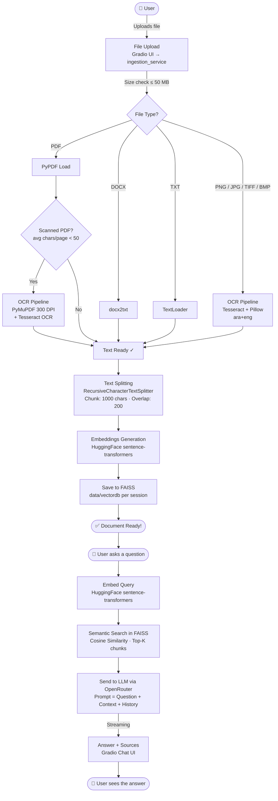

# 📚 DocuMind AI — Document Q&A System
> Intelligent Q&A system based on RAG (Retrieval-Augmented Generation) with streaming support, auto language detection, and **OCR support for scanned PDFs & images**.

---

## 🏗️ System Architecture

```
┌─────────────────────────────────────────────────────────┐
│                    Frontend Layer                       │
│              Gradio UI — app/main.py (Port 7860)        │
└──────────────────────┬──────────────────────────────────┘
                       │
┌──────────────────────▼──────────────────────────────────┐
│                 LLM Pipeline Layer                      │
│                                                         │
│  ┌─────────────┐  ┌──────────────┐  ┌────────────────┐  │
│  │  Ingestion  │  │  Retrieval   │  │    Answer Gen  │  │
│  │  Pipeline   │  │  Pipeline    │  │    Pipeline    │  │
│  │             │  │              │  │                │  │
│  │ Load → OCR? │  │ Embed Query  │  │ Build Prompt   │  │
│  │ → Split     │  │ → MMR Search │  │ → Stream LLM   │  │
│  │ → Embed     │  │ → Top-K      │  │ → Citations    │  │
│  │ → Store     │  │              │  │                │  │
│  └─────────────┘  └──────────────┘  └────────────────┘  │
└──────────────────────┬──────────────────────────────────┘
                       │
┌──────────────────────▼──────────────────────────────────┐
│                   Storage Layer                         │
│                                                         │
│  ┌─────────────┐  ┌──────────────┐  ┌────────────────┐  │
│  │File Storage │  │  Vector DB   │  │  Chat Memory   │  │
│  │data/uploads │  │    FAISS     │  │  RAM + Session │  │
│  └─────────────┘  └──────────────┘  └────────────────┘  │
└─────────────────────────────────────────────────────────┘
```

---

## 🔄 RAG Pipeline Flow



### 📋 Step-by-step Pipeline

| Step | What happens |
|------|-------------|
| **1. Upload** | User uploads a file via the sidebar |
| **2. Extract** | PDF (text) → PyPDF · PDF (scanned) → PyMuPDF + Tesseract · Image → Tesseract · DOCX → docx2txt · TXT → TextLoader |
| **3. Split** | Text split into 1000-char chunks with 200-char overlap |
| **4. Embed** | Each chunk converted to a numeric vector (HuggingFace) |
| **5. Store** | Vectors saved in a per-session FAISS index |
| **6. Query** | User question embedded and matched against stored chunks |
| **7. Generate** | Matched chunks + question sent to LLM (OpenRouter) |
| **8. Stream** | Answer streamed token-by-token to the chat UI + sources cited |

### 🗺️ Detailed Project Flowchart

```
┌─────────────────────────────────────────────────────────────────────────┐
│                       DocuMind AI — RAG Pipeline                        │
└─────────────────────────────────────────────────────────────────────────┘

╔══════════════════╗
║      User        ║
╚════════╤═════════╝
         │
         │  Uploads a document
         ▼
╔══════════════════════════════════════════════════╗
║           File Upload (ingestion_service)         ║
║        Gradio UI  ──►  Size check (Max 50 MB)    ║
╚════════════════════╤═════════════════════════════╝
                     │
                     ▼
        ┌─────────────────────────┐
        │      File Type?         │
        └──┬──────┬──────┬───┬───┘
           │      │      │   │
        PDF│  DOCX│   TXT│  IMG│ (PNG/JPG/TIFF/BMP)
           │      │      │   │
           ▼      │      │   ▼
 ┌──────────────┐ │      │ ┌──────────────────────────┐
 │  PyPDF Load  │ │      │ │  OCR Pipeline             │
 └──────┬───────┘ │      │ │  Tesseract + Pillow        │
        │         │      │ │  (ara+eng languages)       │
        │         │      │ └────────────┬──────────────┘
        │  ┌──────┘      │              │
        │  │             ▼              │
        │  │  ┌──────────────┐          │
        │  │  │  docx2txt    │          │
        │  │  └──────┬───────┘          │
        │  │         │    ┌─────────────┘
        ▼  ▼         ▼    ▼
┌────────────────────────────────────────────────┐
│   Scanned PDF? is_scanned_pdf()                │
│   avg chars/page < 50 ?                        │
└─────────────────────┬──────────────────────────┘
          YES         │         NO
         ┌────────────┘     └──────────────────┐
         ▼                                     ▼
┌─────────────────────────┐       ┌──────────────────────┐
│  OCR Pipeline            │       │  Text Ready ✓        │
│  PyMuPDF (300 DPI)      │       └──────────┬───────────┘
│  + Tesseract OCR        │                  │
└────────────┬────────────┘                  │
             └──────────────────┬────────────┘
                                │
                                ▼
╔═══════════════════════════════════════════════════════╗
║          Text Splitting                               ║
║    RecursiveCharacterTextSplitter                     ║
║    Chunk Size: 1000 chars  |  Overlap: 200 chars      ║
╚═══════════════════════════╤═══════════════════════════╝
                            │
                            ▼
╔═══════════════════════════════════════════════════════╗
║          Embeddings Generation                        ║
║    HuggingFace sentence-transformers                  ║
║    (each Chunk → numeric Vector)                      ║
╚═══════════════════════════╤═══════════════════════════╝
                            │
                            ▼
╔═══════════════════════════════════════════════════════╗
║          Save to FAISS Vector Store                   ║
║    FAISS Index  ──►  data/vectordb/{session_id}       ║
╚═══════════════════════════╤═══════════════════════════╝
                            │
              ✅ Document Ready!
                            │
════════════════════════════╪═══════════════════════════
             User asks a question
════════════════════════════╪═══════════════════════════
                            │
╔═══════════════════════════╧═══════════════════════════╗
║          User Query                                   ║
║          Gradio Chat UI  ──►  chat_service            ║
╚═══════════════════════════╤═══════════════════════════╝
                            │
                            ▼
╔═══════════════════════════════════════════════════════╗
║          Embed Query                                  ║
║    HuggingFace sentence-transformers                  ║
╚═══════════════════════════╤═══════════════════════════╝
                            │
                            ▼
╔═══════════════════════════════════════════════════════╗
║          Semantic Search in FAISS                     ║
║    Cosine Similarity  ──►  Top-K Chunks               ║
╚═══════════════════════════╤═══════════════════════════╝
                            │
                            ▼
╔═══════════════════════════════════════════════════════╗
║          LLM via OpenRouter API                       ║
║    Prompt = Question + Context (Chunks) + History     ║
╚═══════════════════════════╤═══════════════════════════╝
                            │  Streaming ▼
╔═══════════════════════════════════════════════════════╗
║          Answer + Sources                             ║
║    Gradio Chat UI  ◄──  Streaming Response            ║
║    📄 Sources with page number & excerpt              ║
╚═══════════════════════════════════════════════════════╝
                            │
                            ▼
                    ╔══════════════════╗
                    ║  User sees the   ║
                    ║  answer  ✅      ║
                    ╚══════════════════╝

LEGEND:
  ╔══╗  Main Process
  ┌──┐  Decision / Branch
  ──►   Flow Direction
```

---


### Prerequisites
- Python 3.10+
- At least 4GB RAM
- [OpenRouter API](https://openrouter.ai) Key (Free tier available)
- **[Tesseract OCR](https://github.com/UB-Mannheim/tesseract/wiki)** *(required for scanned PDF / image OCR)*

### Steps

**Quick Setup (Windows):**
```bat
setup.bat
```
The script will automate everything: venv creation, installing dependencies, creating directories, and generating `.env`.

**Or Manually:**
```bash
# 1. Install dependencies
pip install -r requirements.txt

# 2. Setup environment variables
copy .env.example .env
# Edit .env and add your OPENROUTER_API_KEY

# 3. Run the UI
python -m app.main
```

Open your browser at: **http://localhost:7860**

> **OCR Note:** To enable OCR for scanned PDFs and images, install [Tesseract](https://github.com/UB-Mannheim/tesseract/wiki) and make sure it's in your system `PATH`. Arabic OCR requires the `ara` language pack (selectable during Tesseract installation).

---

## 📁 Project Structure

```
project/
├── app/
│   ├── core/
│   │ ├── config.py             # Constants and configs
│   │ ├── locks.py              # Threading locks
│   │ └── exceptions.py         # Custom application exceptions
│   │
│   ├── services/
│   │   ├── chat_service.py       # Handles chat messages and logic
│   │   ├── ingestion_service.py  # Handles document processing (+ OCR fallback)
│   │   ├── ocr_service.py        # OCR engine (Tesseract + PyMuPDF)
│   │   └── retrieval_service.py  # LangChain pipelines and retrieval
│   │
│   ├── llm/
│   │   ├── llm_factory.py        # Chat LLM initialization (OpenRouter)
│   │   └── embeddings_factory.py # Embeddings instantiation (HuggingFace)
│   │
│   ├── evaluation/
│   │   ├── metrics.py            # Answer evaluation formulas
│   │   └── evaluator.py          # Quality and latency tests runner
│   │
│   ├── session/
│   │   └── manager.py            # Global dict storage for state
│   │
│   ├── utils/
│   │   └── helpers.py            # Reusable text processors
│   │
│   ├── api.py                    # REST API (FastAPI) — Optional
│   ├── ui.py                     # Gradio UI components and event handlers
│   └── main.py                   # Entry point for the application
│
├── data/
│   ├── uploads/                  # Uploaded documents
│   ├── vectordb/                 # FAISS vector database (by session)
│   └── cache/                    # Embeddings cache
│
├── tests/                        # Directory for application tests
│
├── .env                          # Environment variables (Do NOT push to GitHub)
├── .env.example                  # Environment template (Safe to push)
├── requirements.txt           
└── README.md
```

---

## ⚙️ Environment Variables

| Variable | Default Value | Description |
|----------|---------------|-------------|
| `OPENROUTER_API_KEY` | — | OpenRouter API Key **(Required)** |
| `base_url` | `https://openrouter.ai/api/v1` | API base URL |
| `OPENROUTER_MODEL` | `stepfun/step-3.5-flash:free` | Model name |
| `CHUNK_SIZE` | `1000` | Text chunk size |
| `CHUNK_OVERLAP` | `200` | Overlap between chunks |
| `TOP_K_RESULTS` | `4` | Number of retrieved results |
| `MAX_FILE_SIZE_MB` | `50` | Maximum allowed file size |
| `PORT` | `7860` | Gradio Port |

---

## 🌟 Features

| Feature | Details |
|---------|---------|
| 🌍 **Auto Language** | Responds in English or Arabic automatically based on your question |
| ⚡ **Instant Stream** | Answers appear token by token continuously |
| 🧮 **LaTeX** | Full support for displaying mathematical equations |
| 💬 **Chat Memory** | Remembers the last 10 messages per session |
| 📄 **File Types** | PDF · DOCX · TXT · PNG · JPG · TIFF · BMP |
| 🔍 **MMR Search** | Diverse retrieval to avoid repetition |
| � **Auto OCR** | Automatically detects scanned PDFs and extracts text via Tesseract |
| 🖼️ **Image Support** | Upload PNG/JPG/TIFF images and chat with their content |
| �📊 **Auto Evaluation** | Evaluates answer quality and saves the report |
| 🔧 **Session Restore** | Reloads the vectorstore from disk when needed |

---

## 📊 Performance Indicators

| Metric | Target | Status |
|--------|--------|--------|
| File Upload & Process | ≤ 3s | ✅ |
| Full Answer (Streaming)| ≤ 5s | ✅ |
| Retrieval (MMR) | < 1s | ✅ |
| OCR Processing | varies by page count | ✅ |
| Answer Accuracy | > 80% | Depends on the Model |

---

## 🔒 Security

- ✅ Storage is local only — data is only sent to the LLM.
- ✅ Validates file type and size before processing.
- ✅ Input sanitization.
- ✅ Auto cleanup for old sessions (every 2 hours).
- ⚠️ Do NOT upload your `.env` file to GitHub.

---

## 📚 Tech Stack

| Layer | Technology |
|-------|------------|
| Frontend | Gradio 4+ |
| LLM Orchestration | LangChain (LCEL) |
| Embeddings | HuggingFace `all-MiniLM-L6-v2` |
| Embedding Cache | LangChain `CacheBackedEmbeddings` |
| Vector DB | FAISS |
| LLM Provider | OpenRouter API |
| Document Loaders | PyPDF · Docx2txt · TextLoader |
| OCR Engine | Tesseract via `pytesseract` |
| PDF Renderer | PyMuPDF (no Poppler required) |

---

## 🧪 Running Evaluator

```python
from app.evaluation.evaluator import SystemEvaluator

eval = SystemEvaluator()

# Test an answer
result = eval.evaluate_answer(
    question="What is the document about?",
    answer=answer,
    expected_keywords=["subject", "document"],
    latency=2.1
)

# Test latency performance
perf = eval.latency_test(ask_question, "What is the subject?", runs=5)
eval.print_summary()

# Save the report
eval.save_report("eval_report.json")
```

> 📝 Evaluation happens automatically after every real question and is saved inside `eval_report.json`.
